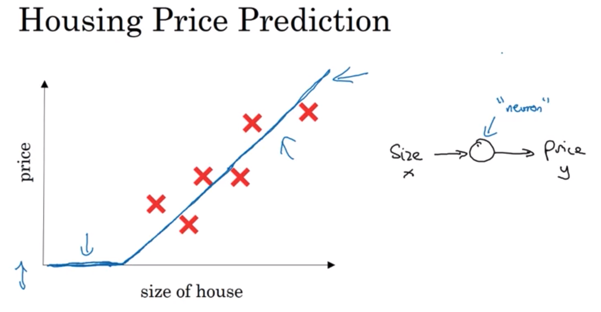
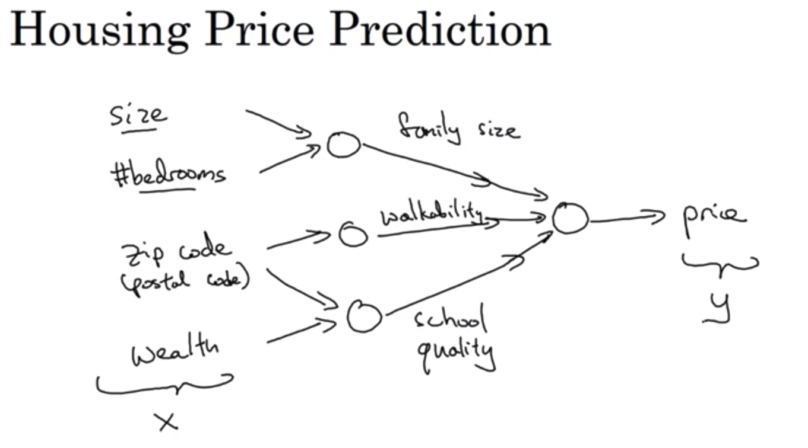
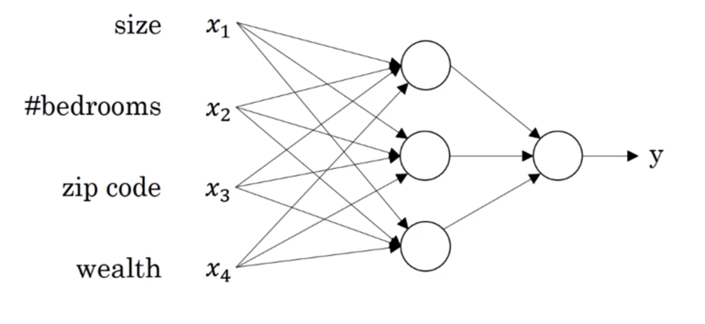
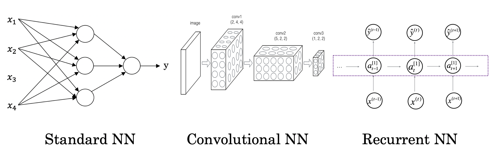
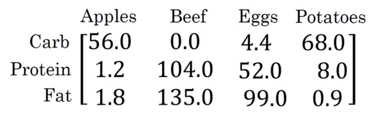
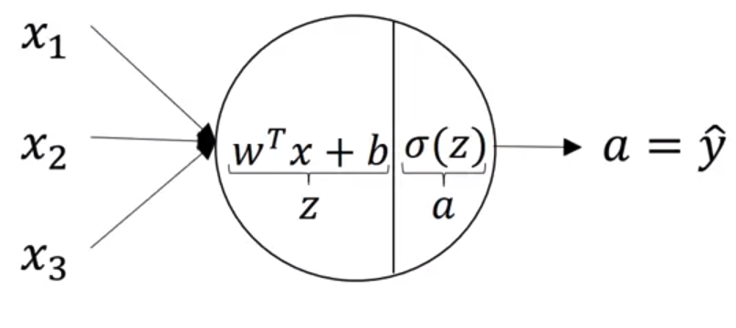
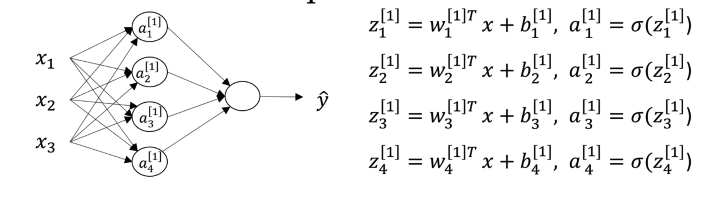

# What is a Neural Network?

Think about this function of housing prices as very simple neural network:

<p align="center">

</p>

The little circle is a single neuron of a neural network, that implements the function (ReLU) that is drawn on the left. All the neuron does is it inputs the size, computes this linear function, takes a max of zero, and then outputs the estimated price.

A larger neural network is formated by taking many of the single neurons and stacking them together. As well, each of the little circles implements the Rectified Linear Unit function (or some other slightly non-linear function). By stacking together a few of the single neurons or simple predictors, we have now a a larger neural network.

<p align="center">

</p>

To feed the network, you need to give it just the input x and the output y for a number of examples in your training set and the neural network will figure it out by itself the hidden layer in the middle. The input layer and the hidden layer are density connected: every input feature is connected to every "hidden" feature.

<p align="center">

</p>

# Supervised Learning with Neural Networks

There are different types of neural network, for example Convolution Neural Network (CNN) used often for image application and Recurrent Neural Network (RNN) used for one-dimensional sequence data such as translating English to Chinses or a temporal component such as text transcript. As for the autonomous driving, it is a hybrid neural network architecture.

<p align="center">

</p>

Structured data refers to things that has a defined meaning such as price, age whereas unstructured data refers to thing like pixel, raw audio, text.

# Binary Classification and Logistic Regression

In a binary classification problem, the result is a discrete value output.

The feature matrix shape is made "stacking" the number of features () in different columns, one for every observation (): . The output shape is a 1 by  dimensional matrix; 

Logistic regression is used for binary classification, when the output labels are either 0 or 1: , where .

The parameters used in Logistic regression are:

* The input features vector: , where  is the number of features
* The training label: 
* The weights: 
* The threshold: 
* The output: 
* The Sigmoid function:  where 

# Logistic Regression Loss and Cost Function

The **Loss function** measures the discrepancy between the prediction () and the desired output (). In other words, the loss function computes the error for a single training example.

The **Cost function** is the average of the loss function of the entire training set. We are going to find the parameters  and  that minimize the overall cost function.

The loss function computes the error for a single training example; the cost function is the average of the loss functions of the entire training set.

<p align="center"></p>

# Logistic Regression Gradient Descent

The gradient descent algorithm is:

<p align="center"></p>

<p align="center"></p>

where:  and  represents the weights and the threshold,  is the assignment ("update") math symbol and  is the learning rate.

# Vectorization and Broadcasting in Python

Avoid explicit for-loops whenever possible. Using  the numpy version ()"") of "" is about 300 times faster than an explicit for loop.

When we use the numpy version, python automatically transform the constant (or 1x1 matrix) "b" and expand to a "1xm" matrix to sum the matrices: . This is called "broadcasting", its also faster way to compute the code.

- Example: Calculating the percentage of calories from carb/protein/fat for each food — without fooloop from the following table

<p align="center">

</p>

In Python would be:

```python
import numpy as np
A = np.array([[56, 0, 4.4,68],
              [1.2,104,52,8],
              [1.8,135,99,0.9]
              ])
print(A)
cal = A.sum(axis=0) # axis=0 is to make python sum vertically, axis=1 would make the sum horizontally.
print(cal)
percentage = 100*A/cal.reshape(1,4) #Taking the 3x4 matrix "A" and diving it by the 1x4 matrix "cal".
print(percentage)
```
Resulting in a 3x4 matrix.

- Python broadcast (or "force") matrices to make the operation match.

As a "General Principle": When you sum, subtract, divide or multiply (m,n) matrix with a (1,n), matrix the (1,n) matrix will be expanded to a (m,n) matrix by copying the row m times, to match the shape.

For example, a 4x1 matrix plus a number would treat the number as a 4x1 matrix with each row the number. A 2x3 matrix plus a 1x3 matrix would treat the last as a 2x3 matrix creating a row with the same numbers and so forth.

```python
a = np.random.randn(2, 3) # a.shape = (2, 3)
b = np.random.randn(2, 1) # b.shape = (2, 1)
c = a + b
c.shape # (2,3)

a = np.random.randn(3, 3)
b = np.random.randn(3, 1)
c = a*b
c.shape # (3,3)

d = np.random.randn(4, 3) # a.shape = (4, 3)
e = np.random.randn(3, 2) # b.shape = (3, 2)
f = d*e # Error: operands could not be broadcast together

```

This allows to write quite a flexible code, but it also allows to start creating product matrices that create bugs difficult to track. Specify always the matrix shape and don't use rank 1 matrices: "np.random.randn(5,1)" instead of "np.random.randn(5)" for a five column vector, for example.

# Shallow Neural Network

<p align="center">

</p>

What a Neural Network does is doing the logistic regresion for each neuron. This logistic regression has 2 steps of computation: it's own regression  and an activation function 

<p align="center">

</p>

So for each neuron  or node in the layer you have:  and  where n is the layer number:

<p align="center">

</p>

In this Neural Network example with 2 layers and 4 logistic regression, we can stack the vectors together of the entire layers to make:

-  as a vector (4x3) of ;
-  as a vector (4x1) of ;
-  as a vector (4x1) of 
