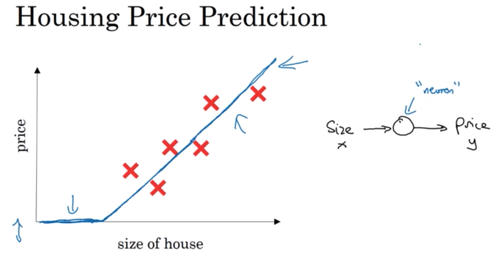
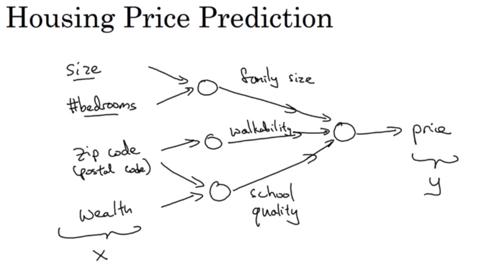

# What is a Neural Network?

Think about this function of housing prices as very simple neural network:

The little circle is a single neuron of a neural network, that implements the function (ReLU) that is drawn on the left. All the neuron does is it inputs the size, computes this linear function, takes a max of zero, and then outputs the estimated price.

A larger neural network is formated by taking many of the single neurons and stacking them together. As well, each of the little circles implements the Rectified Linear Unit function (or some other slightly non-linear function). By stacking together a few of the single neurons or simple predictors, we have now a a larger neural network.

To feed the network, you need to give it just the input x and the output y for a number of examples in your training set and the neural network will figure it out by itself the hidden layer in the middle. The input layer and the hidden layer are density connected: every input feature is connected to every "hidden" feature.

