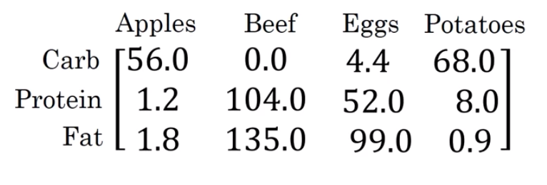
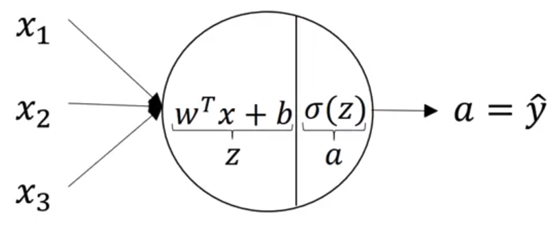
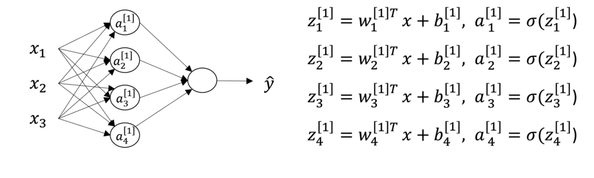

# What is a Neural Network?

Neural Networks are collection of connected units or nodes called "neurons", which loosely model the neurons in a biological brain. The combination of neurons "learn" to perform tasks by considering examples, without being programmed with task-specific rules. Think about this function of housing prices as very simple neural network:

<p align="center">

</p>

The little circle is a a representation of a single "**neuron**" of a neural network. The neuron takes an input, the size of the house, to try to explain the variance in an output, the price of the house. The neuron uses an algorithm to process the input into output, in this case the activation function in the graph called Rectified Linear Unit function (ReLU). A **Neural Network** is created by stacking neurons together. Each of the neurons stacked implements ReLU, or some other slightly non-linear function.

<p align="center">

</p>

A Neural Network needs a large number of inputs and their output, a lot of examples to find the pattern that explains the output. In the example, a large dataset of houses prices associated with their size. The "**hidden layers**" are made by the neurons itself.
The first layer, the **input layer**, and the hidden layers are connected: every input feature is connected to every "hidden" feature.

<p align="center">

</p>

The Neural Network uses the size, the number of bedroom, zipcode, wealth and so into "hidden units" that explains the prize. This hidden units are made by the neurons without explicitly telling them (it's a "machine" learning a pattern). Therefore, some times you can find this models refered as "**black boxes**": we don't know how the algorithm is accomplishing what its accomplishing-
# Supervised Learning with Neural Networks

There are different types of neural networks, for example Convolution Neural Network (CNN) used often for image application. Recurrent Neural Networks (RNN) are used for one-dimensional sequence data such as translating English to Chinese or a temporal component such as text transcript. Hybrid Neural Networks architecture can be used for autonomous driving model.

<p align="center">

</p>

For now the only difference that we have to know is between structured and unstructured data:

- **Structured data**: it has a defined meaning, such as price and size.
- **Unstructured data**: it does not have a define meaning by itself. Like a pixel, raw audio or text.

# Binary Classification and Logistic Regression

In a **binary classification problem**, the result is a discrete value output: a 1 or a 0. For example, trying to explain a catastrophe survival rate: a person survived (1) or did not (0).

The feature matrix shape is made "stacking" the number of features ($n_x$) in different columns, one for every observation ($m$): $X.shape = (n_x, m)$. The output shape is a 1 by $m$ dimensional matrix; $y.shape = (1,m)$

As an example, take this feature matrix in which the features are Carb, Protein and Fat, the observations Apple, Beef, Eggs and Potatoes. The output shape can be one and only row of 0 or 1s for every food, depending if they are healthy (1) or not (0).
<p align="center">

</p>

**Logistic regression** is used for binary classification, when the output labels are either 0 or 1: $\hat{y} = P(y=1|x)$, where $0 \leq \hat{y} \leq 1$.

The parameters used in Logistic regression are:

* The input features vector: $x\in{R^{n_{x}}}$, where $n_{x}$ is the number of features
* The training label: $y\in0,1$
* The weights: $w\in{R^{n_{x}}}$
* The threshold: $b\inR$
* The output: $\hat{y}= \sigma(w^{T}x + b)$
* The Sigmoid function: $\sigma(z)=\frac{1}{1+e^{-z}}$ where $z=w^{T}x + b$

This points will be explained later.

# Logistic Regression Loss and Cost Function

The **Cost function** is the **average of the loss function** of the entire training set. We are going to find the parameters ($\hat{y}$) and the desired output ($y$). In other words, the loss function computes the error for a single training example.

The **Cost function** is the **average of the loss function** of the entire training set. We are going to find the parameters $w$ and $b$ that minimize the overall cost function.

The loss function computes the error for a single training example; the cost function is the average of the loss functions of the entire training set.

\begin{align*}
    J(w,b)=\frac{1}{m}\sum\limits_{i=1}^{m}L(\hat{y}^{(i)}, y^{(i)})=-\frac{1}{m}\sum\limits_{i=1}^{m}(y^{(i)}log(\hat{y}^{(i)})+(1-y^{(i)})log(1-y^{(i)})
\end{align*}

# Logistic Regression Gradient Descent

The gradient descent algorithm is:

\begin{align*}
  w := w - \alpha\frac{dJ(w,b)}{dw}
\end{align*}

\begin{align*}
  b := b - \alpha\frac{dJ(w,b)}{db}
\end{align*}

where: $w$ and $b$ represents the weights and the threshold, $:=$ is the assignment ("update") math symbol and $\alpha$ is the learning rate.

# Vectorization and Broadcasting in Python

Avoid explicit for-loops whenever possible. Using  the numpy version ()"$z = np.dot(w, x) + b$") of "$z = w^{T}X + b$" is about 300 times faster than an explicit for loop.

Python automatically transform the constant (or 1x1 matrix) "b" and expand to a "1xm" matrix to sum the matrices: $b = [b_1, b_2, b_3...b_n]$. This is called "**broadcasting**", its also faster way to compute the code.

- Example: Calculating the percentage of calories from carb/protein/fat for each food — without fooloop from the following table

<p align="center">

</p>

In Python would be:

```python
import numpy as np
A = np.array([[56, 0, 4.4,68],
              [1.2,104,52,8],
              [1.8,135,99,0.9]
              ])
print(A)

 [ 56.    0.    4.4  68. ]
 [  1.2 104.   52.    8. ]
 [  1.8 135.   99.    0.9]

cal = A.sum(axis=0) # axis=0 is to make python sum vertically, axis=1 would make the sum horizontally.
print(cal)

[ 59.  239.  155.4  76.9]

percentage = 100*A/cal.reshape(1,4) #Taking the 3x4 matrix "A" and diving it by the 1x4 matrix "cal".
print(percentage)

 [94.91525424  0.          2.83140283 88.42652796]
 [ 2.03389831 43.51464435 33.46203346 10.40312094]
 [ 3.05084746 56.48535565 63.70656371  1.17035111]

```
Resulting in a 3x4 matrix.

- Python broadcast (or "force") matrices to make the operation match.

As a "General Principle": When you sum, subtract, divide or multiply (m,n) matrix with a (1,n), matrix the (1,n) matrix will be expanded to a (m,n) matrix by copying the row m times, to match the shape.

For example, a 4x1 matrix plus a number would treat the number as a 4x1 matrix with each row the number. A 2x3 matrix plus a 1x3 matrix would treat the last as a 2x3 matrix creating a row with the same numbers and so forth.

```python
a = np.random.randn(2, 3) # a.shape = (2, 3)
b = np.random.randn(2, 1) # b.shape = (2, 1)
c = a + b
c.shape # (2,3)

a = np.random.randn(3, 3)
b = np.random.randn(3, 1)
c = a*b
c.shape # (3,3)

d = np.random.randn(4, 3) # a.shape = (4, 3)
e = np.random.randn(3, 2) # b.shape = (3, 2)
f = d*e # Error: operands could not be broadcast together
```

This allows to write quite a flexible code, but it also allows to start creating product matrices that create bugs difficult to track. Specify always the matrix shape and don't use rank 1 matrices: "np.random.randn(5,1)" instead of "np.random.randn(5)" for a five column vector, for example.

# Neural Networks Overview and Vectorized Implementation

<p align="center">

</p>

What a Neural Network does is doing the logistic regression for each neuron. This logistic regression has *2 steps of computation**:

- A logistic regression $z= w^{T}+b$
- An activation function $a = \sigma(z)$

<p align="center">

</p>

So for each neuron $i$ or node in the layer you have: $z_i^{[n]}= w_i^{[n]T}+b_i^{[n]}$ and $a_i^{n} = \sigma(z_i^{n})$ where n is the layer number:

<p align="center">

</p>

In this Neural Network example with 2 layers and 4 neurons, we can stack the vectors together of the entire layers to make a vectorized implementation:

- $W^{[1]}$ as a vector (4x3) of $[W_1^{[1]}, W_2^{[1]},W_3^{[1]},W_4^{[1]}]$;
- $b^{[1]}$ as a vector (4x1) of $[b_1^{[1]}, b_2^{[1]},b_3^{[1]},b_4^{[1]}]$;
- $Z^{[1]}$ as the vector dot product of $W^{[1]}x + b^{[1]}$;
- $A^{[1]}$ as a vector (4x1) of $[a_1^{[1]}, a_2^{[1]},a_3^{[1]},a_4^{[1]}] = \sigma(z^{[1]})$.

# Activation functions

When you build your Neural Network, one of the choices you get to make is what activation function to use in the hidden layers.

The sigmoid function goes within zero and one. An activation function that almost always works better than the sigmoid function is the tangent function or also called **hyperbolic tangent function (Tanh)*:

<p align="center">

</p>

It goes between 1 and - 1. The tanh function is almost always strictly superior. The **one exception** is for the output layer because if y is either 0 or 1, then it makes sense for y hat to be a number, the one to output that's between 0 and 1 rather than between minus 1 and 1.

One of the downsides of both the sigmoid function and the tanh function is that if z is either very large or very small, then the gradient or the derivative or the slope of this function becomes very small.

Another choice that is very popular in machine learning is what's called the **rectify linear unit (ReLU)**. So the value function looks like:

<p align="center">

</p>

The derivative is 1 as z is positive. And the derivative or  slope is 0, when z is negative. Is an increasingly default choice of activation function.

In practice, using the ReLU activation function, your neural network will often **learn much faster** than Tanh or Sigmoid activation function. The main reason is that there is less of these effects of the slope of the function going to 0, which slows down learning.

If you use a linear activation function, or alternatively if you don't have an activation function, then no matter how many layers your neural network has, all it's doing is just computing a linear activation function. A linear hidden layer is more or less useless because the composition of two linear functions is itself a linear function.

# Derivatives of activation functions

* Sigmond Function: $g'(z) = g(z) * (1 - g(z)) = a * (1-a)$
* Tanh Function: $g'(z) = 1 - (tanh(z))^2 = 1 - a^2$

Where $a = g()$ is a nonlinear function.

* ReLU Function: $g'(z) = 0 when z<0$ and $g'(z) = 1, when z>=0$
* Leaky ReLU Function: $g'(z) = 0.01, when z<0$
and $g'(z) = 1 when z>=0$

# Gradient descent for Neural Networks

The gradient is a numeric calculation allowing us to know how to adjust the parameters (weights, bias) of a network in such a way that its output deviation (cost function) is minimized:

$J(w^{[1]},b^{[1]},w^{[2]},b^{[2]}) = \fraq{1/m} * \sum(L(\hat{y}, y))$

# Random Initialization

When you change your neural network, it's important to initialize the weights randomly. Random initialization of the model is a common practice. The rational behind is that from wherever we start, if we are perseverant enough and through an iterative learning process, we can reach the pseudo-ideal model.

We can initialize the weights randomly and the bias at zero.

If we initialize both weights and bias to zeros, all activations functions (a_{i,j,...}) will be equal. All the neurons units would start off computing the same function and therefore all the hidden neurons completely identical. Again, using hidden layers would be useless.

# Forward Propagation in Deep Networks

A "**Deep Neural Network**" is just a Neural Network with many layers. The number of layers is up to you. It is another hyperparameter that we can modify to improve the accuracy of the model and it's speed.  

In **Forward propagation**, the weight vectors and bias vectors of the next layer depends on the vectors of the previous one:

$z^[l]= w^[l]a^[l-1]+b^[l]$
$a^[l]= g(z^[l])$

A 4 layers **example**:

<p align="center">

</p>

Input Layer:

$z^[1]= w^[1]a^[0]+b^[1]$
$a^[1]= g(z^[1])$

 $z^[1]$ is the first logistic regressions parametrized by the weights, type activation function used and bias: $w^[1]a^[0]+b^[1]$. In the first layer, $a^[0]$ is the covariates X, since we don't have a previous activation function. It continues, using the optimized parameters of the last layers:

First Hidden Layer:

$z^[2]= w^[2]a^[1]+b^[2]$
$a^[2]= g(z^[2])$

Second Hidden Layer:

$z^[3]= w^[3]a^[2]+b^[3]$
$a^[3]= g(z^[3])$

Output Layer:

$z^[4]= w^[4]a^[3]+b^[4]$
$a^[4]= g(z^[4])$

Where $a^[4]$ is the outcome variable that you want to predict: $\hat{y}$

# Getting the dimensions rights

Taking the previous example with 4 layers
